# SteadyFrame

Finds flashing hazards in video, fixes them with the least invasive change, and verifies
its own fix. Checks content against published photosensitivity thresholds (WCAG 2.2
SC 2.3.1; ITU-R BT.1702 / Ofcom guidance as a second profile), localises every hazard in
time and space, and runs a closed loop: choose a fix, apply, re-analyse, escalate or ask a
human, re-verify the whole file.

Built for the OpenCV AI Competition 2026 (powered by AWS) on **OpenCV 5**
(`opencv-python-headless 5.0.0.93`), Python 3.11 and AWS (Lambda, S3, SQS, ECS Fargate on
Graviton, DynamoDB, Bedrock, CDK). Solo entry.

**Not a medical device.** A pass is not a certification; see `docs/RESPONSIBLE_USE.md`.



## Quickstart

```bash
make install            # venv + pinned deps (requirements.lock) + editable install
make test               # 100+ tests, OpenCV 5 asserted at import
make synth              # deterministic hazardous test suite -> data/synthetic (gitignored, never play it)

steadyframe analyze data/synthetic/m_two_segments.mp4 --json out.json --plot out.png
steadyframe fix data/synthetic/m_two_segments.mp4 --policy fixed -o safe.mp4 --report report.json
steadyframe fix in.mp4 --policy agent -o safe.mp4      # Bedrock; needs STEADYFRAME_BEDROCK_MODEL_ID
steadyframe fix in.mp4 --policy heuristic -o safe.mp4  # same loop, deterministic stand-in, offline
```

`analyze` prints the verdict and every segment (type, time range, flash rate, area,
luminance swing, region, severity) and exits 2 on `fail`. `fix` writes the remediated
video, a `report.json` and a `trace.jsonl` of every decision.

Web endpoint, local: `docker compose up` then http://localhost:8080. AWS: `make deploy`
(see `infra/README.md`), then `make smoke`. Deployed endpoint: to be added once it is up.

## How it works

1. **Analyze** (`steadyframe/analyzer.py`): per frame, `cv2.LUT` sRGB-to-linear, `INTER_AREA`
   resize to a 64x48 grid, `cv2.transform` for relative luminance, a vectorised per-cell
   transition tracker (accumulated change between local extrema, 0.10 threshold, darker
   state below 0.80), trailing one-second windows by timestamp, the 25%-of-any-10-degree
   window area rule with `cv2.boxFilter`, regions from `cv2.connectedComponentsWithStats`.
2. **Remediate** (`steadyframe/remediate/`): S1 regional temporal low-pass
   (`cv2.accumulateWeighted` in linear light), S2 luminance-swing compression, S3 red
   desaturation, S4 the same globally, S5 frame hold, S6 warning card. Quality: SSIM
   (`cv2.GaussianBlur`), PSNR, luminance change, temporal smoothness. Audio is remuxed.
3. **Loop** (`steadyframe/agent/`): a model on Amazon Bedrock (Converse API tool use) or a
   deterministic policy calls `analyze_video`, `get_segment_detail`, `apply_remediation`,
   `verify_candidate`, `request_human_approval`, `accept_candidate`, `finalize`. The model
   never sees pixels. Every failure mode degrades to the fixed policy; every call goes to
   the trace. Details: `docs/AGENT.md`, diagram: `docs/diagrams/agent_workflow.svg`.

## Results (synthetic suite, reproduced by `make eval`)

| | |
|---|---|
| Detection: clip verdicts, boundary cases, per-second F1 | 44/44, 17/17, 1.000 |
| Robustness: H.264 CRF 28/35 variants keeping their verdict | 16/16 |
| Remediation (fixed policy): whole-file re-verification pass rate | 25/25, 1.1 iterations per segment |
| Agent (heuristic stand-in) vs fixed | same pass rate, 1.0 iterations per segment, higher SSIM inside regions |
| Analyzer throughput, 720p, 4-vCPU x86, stock wheel | ~600 fps analysis-only, ~400 fps with decode |

Full tables: `eval/results/frozen/*.md`; failure gallery: `eval/results/frozen/failures.md`;
technical report: `docs/report/REPORT.md`; benchmark protocol and the three-configuration
table (x86 / Graviton / COOL): `bench/README.md`, `bench/results/comparison.md`.

## Repository

```
steadyframe/   analyzer, profiles, remediation strategies, agent loop, CLI
synth/         synthetic clip generator + independent 1-D reference for ground truth
eval/          detection, robustness, remediation, agent_vs_fixed, failures, report renderer
bench/         x86 / Graviton / COOL benchmark harness
service/       Lambda handlers, worker, local FastAPI, smoke test     infra/  CDK (Python)
web/           React UI (flash-safe, WCAG AA, axe check in CI)
docs/          STANDARDS, DECISIONS, PRIOR_ART, AGENT, API, RESPONSIBLE_USE, report, diagrams
```

Standards text and every
implementation decision: `docs/STANDARDS.md`, `docs/DECISIONS.md`.

## Licence

Apache-2.0. Synthetic test clips are generated locally and never distributed.
