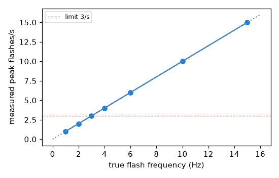
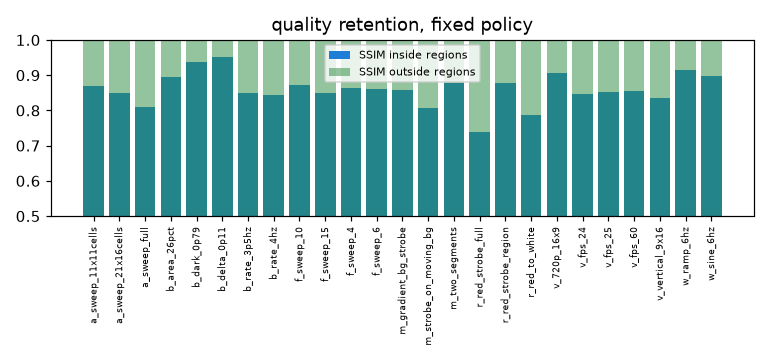
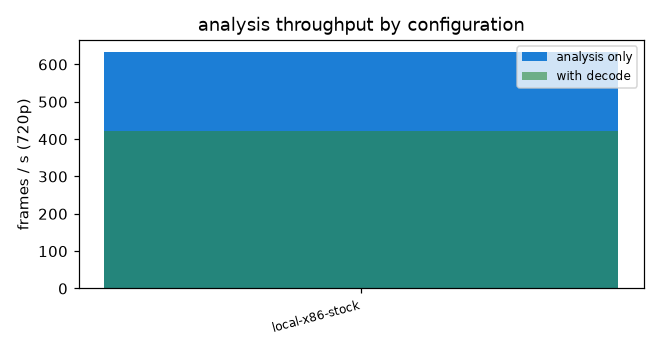

# SteadyFrame: closed-loop photosensitive-hazard analysis and remediation for video

Technical report. OpenCV AI Competition 2026, powered by AWS. Solo entry, Srija Vuppula.
Repository: `steadyframe` (this file is rendered by `python -m eval.report` from the frozen
evaluation results; every number below is produced by a script under `eval/` or `bench/`).

## 1. Problem and users

Flashing and high-contrast patterned video can trigger seizures in people with
photosensitive epilepsy. Broadcasters test with Harding FPA, a commercial tool; the free
alternative, PEAT, is a decade old and its licence excludes content produced for
broadcast, film, home entertainment and games. Both return a pass/fail verdict on the
whole file. A creator who fails does not learn where the hazard is or what would fix it,
and a viewer cannot tell which seconds to avoid.

Users: video creators and editors who must meet WCAG 2.3.1 or broadcast delivery specs;
web and product teams with accessibility obligations; educators and accessibility
researchers who want a reproducible, open implementation of the published thresholds.

What SteadyFrame does: analyse (OpenCV 5), localise in time and space, remediate with the
least invasive strategy that makes the same analyzer pass, verify, escalate or ask a human,
and explain (trace, plots, JSON report). It is served as a reproducible AWS API and UI.

**It is not a medical device.** The thresholds are population guidelines; see section 10.

## 2. Prior art

| Tool | Access | Detects | Localises | Remediates | Verifies its fix |
|---|---|---|---|---|---|
| Harding FPA | commercial | luminance, red, patterns | no | no | - |
| PEAT (Trace Center) | free, closed; not for broadcast/film/games | luminance, red | no | no | - |
| EA IRIS (BSD-3) | open, C++/OpenCV | luminance, red, patterns | no (frame level) | no | - |
| Apple VideoFlashingReduction (MIT) | open reference | risk score | no | global dimming | no |
| Flikcer (arXiv 2108.09491) | research extension | luminance | no | browser dimming | no |
| SteadyFrame | Apache-2.0 | luminance, red, patterns (experimental) | per-cell grid, regions per segment | six strategies, regional first | yes: every candidate re-analysed, whole file re-verified |

Flash detection is not new. The contribution is the closed loop and its evidence:
localisation that makes a regional fix possible, verification by the same analyzer,
escalation with a human in the loop, and a measured evaluation. Nothing more is claimed.

## 3. Standards and definitions

Thresholds are quoted from the primary text in `docs/STANDARDS.md`. Profile `wcag`:
a general flash is a pair of opposing changes in relative luminance of at least 0.10 where
the darker image is below 0.80; a red flash involves saturated red (R/(R+G+B) >= 0.8) with
a change of more than 20 in `max(0, R-G-B) * 320`; content fails when there are more than
three flashes in any one-second period *and* the flashing area exceeds 25% of any
341 x 256 window of a 1024 x 768 viewport. Profile `broadcast` (ITU-R BT.1702 / Ofcom)
uses 25% of the whole screen and the same rate rule; absolute cd/m2 thresholds cannot be
recovered from an sRGB file, which the profile notes say.

Decisions where the text leaves room: transitions are accumulated across monotonic runs
between local extrema (a fade over several frames is one transition), with a 0.02
hysteresis so codec noise does not fragment a run; windows are driven by decoder
timestamps; a flash is two opposing transitions, so `fail` means more than six
transitions in a trailing second; the `conservative` flag warns at exactly six.

## 4. OpenCV 5 implementation

Pinned `opencv-python-headless==5.0.0.93`; `cv2.__version__` is asserted at import and
printed in every report and benchmark. Per frame (`steadyframe/analyzer.py`):

1. `cv2.LUT` with a 256-entry sRGB-to-linear table on the BGR frame (one call, three channels).
2. `cv2.resize(..., INTER_AREA)` of the linear frame to the analysis grid (64 x 48 by
   default). Luminance is linear in the linearised channels, so the luminance of the cell
   average equals the average luminance: `cv2.transform` with the Rec. 709 weights on the
   grid gives the exact per-cell relative luminance. Red ratio and red value are computed
   from the same cell averages. This ordering made the analyzer 12x faster than a
   per-pixel formulation ({{local_x86_stock.clips["bench_strobe.mp4"].fps_excluded:.0f}} fps analysis-only on 720p on the 4-vCPU x86 build host).
3. A vectorised NumPy transition tracker per cell (direction, run extremum, start extremum,
   state flag), one instance for luminance and one for the red metric.
4. Trailing-window transition counts per cell from a deque of timestamped masks.
5. Area rule: `cv2.boxFilter` (normalised, window 341/1024 x 256/768 of the grid, 21 x 16
   cells) over the mask of cells that exceed the rate; any window fraction above 0.25 fails.
6. Segments: contiguous failing frames with a 0.5 s gap tolerance, back-dated to the
   first transition in the window; regions from `cv2.connectedComponentsWithStats` on the
   segment's accumulated flashing mask.
7. Experimental patterns: `cv2.dft` peak (more than five cycles) with a contrast and
   local-variance area test on a 256 x 192 luminance map, sustained over 0.5 s.

Remediation (`steadyframe/remediate/`), all streaming with bounded memory:

| ID | Strategy | OpenCV |
|---|---|---|
| S1 | regional temporal low-pass, feathered mask | `cv2.accumulateWeighted` on linear light, `cv2.GaussianBlur` mask |
| S2 | regional luminance-swing compression toward a running mean | per-pixel gain in linear light |
| S3 | red desaturation toward equal-luminance grey | channel maths in linear light |
| S4 | S1/S2/S3 with a full-frame mask | same |
| S5 | frame hold to 2.5 Hz | frame selection, timing preserved |
| S6 | static warning card | `cv2.putText`, requires approval |

Quality: SSIM with `cv2.GaussianBlur` (11 x 11, sigma 1.5), PSNR, mean luminance change
inside the regions and temporal step ratio; SSIM is unit-tested against a NumPy reference.
Audio is demuxed and remuxed with ffmpeg; frame count and timing are preserved, so A/V
sync is checked by frame count.

## 5. Agent design

Perception, decision, action, perception again (`docs/AGENT.md`). Seven tools:
`analyze_video`, `get_segment_detail`, `apply_remediation`, `verify_candidate`,
`request_human_approval`, `accept_candidate`, `finalize`. The model never sees pixels;
every input it reasons over is an analyzer measurement. `get_segment_detail` includes
parameter hints derived from the physics of the strategies (an EMA leaves
`(1 - r^N)/(1 + r^N)` of a square wave's swing), so parameter choice can be grounded in
the measured rate and swing.

Constraints: 4 iterations per segment, 24 per job, 40 model turns, 3 consecutive tool
errors. Any provider failure (timeout, throttling, malformed call, unavailable model) or
budget exhaustion degrades to the deterministic fixed policy for the open segments; the
trace records a `fallback` decision and the report's `policy` field names both. S6 and any
fix with overall SSIM under 0.75 require `request_human_approval`; the job pauses with
its state persisted and resumes with the decision. Amazon Bedrock is used through the
Converse API with `toolConfig`; the model id is configuration, never code.

Two annotated traces in `docs/examples/` show a verify result changing the next tool call.

## 6. AWS architecture

Browser (React, S3 + CloudFront) -> API Gateway HTTP API -> Lambda (create job, presign,
status, segments, trace, approve, download) -> S3 (uploads/, outputs/, 24 h lifecycle,
SSE, presigned URLs only) and DynamoDB (jobs, traces, 7-day TTL) -> SQS -> ECS Fargate
worker on ARM64/Graviton (Python 3.11, OpenCV 5, ffmpeg, the agent loop) -> Bedrock,
CloudWatch (JSON logs, metrics, dashboard, alarms). Least-privilege IAM per component with
the policy documents in `infra/policies/`. Limits: 100 MB, 120 s, container validation.
`make deploy` prints the endpoint; `make destroy` removes it; `docker compose up` runs the
same worker and API locally.

## 7. Evaluation

### 7.1 Detection (`eval/detection.py`)

Synthetic suite of {{detection.n_clips}} clips generated from a YAML config by
`synth/generate.py`, with ground truth from an independent one-dimensional implementation
of the rules and the analytic area condition. Boundary cases are rendered losslessly
(libx264rgb) and aligned to the analysis grid.

| metric | value |
|---|---|
| clip-level verdict accuracy | {{detection.clip_accuracy:.3f}} |
| hazard-type agreement | {{detection.type_agreement:.3f}} |
| per-second precision / recall / F1 (`fail` positive) | {{detection.per_second.precision:.3f}} / {{detection.per_second.recall:.3f}} / {{detection.per_second.f1:.3f}} |
| boundary cases correct | {{detection.boundary_correct}} / {{detection.boundary_total}} |
| mean temporal IoU vs ground-truth event intervals | {{detection.temporal_iou_mean:.3f}} |
| mean spatial IoU vs ground-truth regions | {{detection.spatial_iou_mean:.3f}} |

Temporal IoU is below 1 by design: a segment ends when the trailing window stops
containing more than three flashes, up to `1 - 3/f` seconds after the last transition.

### 7.2 Robustness (`eval/robustness.py`)

{{robustness_summary.crf_correct}} of {{robustness_summary.crf_total}} H.264 re-encodes
(CRF 28 and 35) keep the expected verdict. Grid sensitivity, wrong verdicts out of the
boundary/negative subset: 32x24: {{robustness_summary.grid[0].wrong_verdicts}},
48x36: {{robustness_summary.grid[1].wrong_verdicts}}, 64x48: {{robustness_summary.grid[2].wrong_verdicts}},
96x72: {{robustness_summary.grid[3].wrong_verdicts}}, 128x96: {{robustness_summary.grid[4].wrong_verdicts}}
(the flips are the 24%/26% area boundary clip, whose region is aligned to the 64x48 grid).
Frame rates 24/25/30/60, 16:9 720p and a 9:16 vertical clip all give the expected verdict.

### 7.3 Remediation, fixed policy (`eval/remediation.py`)

| metric | value |
|---|---|
| clips with hazards | {{remediation.n_clips}} |
| post-verification pass rate (whole file re-analysed) | {{remediation.success_rate:.3f}} |
| mean iterations per segment | {{remediation.mean_iterations_per_segment:.2f}} |
| SSIM outside regions | {{remediation.mean_ssim_outside:.4f}} |
| SSIM inside regions | {{remediation.mean_ssim_inside:.3f}} |
| mean absolute luminance change inside regions | {{remediation.mean_dL_inside:.3f}} |
| approvals requested (auto-granted offline) | {{remediation.approvals_requested}} |
| mean runtime per clip (analyze + fix + verify, 320x240) | {{remediation.mean_runtime_s:.1f}} s |

### 7.4 Agent versus fixed policy (`eval/agent_vs_fixed.py`)

Offline, with the deterministic heuristic provider that follows the same tool protocol
and uses the parameter hints (this measures measurement-driven parameter selection, not
an LLM):

| metric | fixed | agent (heuristic) |
|---|---|---|
| success rate | {{agent_vs_fixed.fixed.success_rate:.3f}} | {{agent_vs_fixed.agent.success_rate:.3f}} |
| iterations per segment | {{agent_vs_fixed.fixed.mean_iterations_per_segment:.2f}} | {{agent_vs_fixed.agent.mean_iterations_per_segment:.2f}} |
| SSIM inside regions | {{agent_vs_fixed.fixed.mean_ssim_inside:.3f}} | {{agent_vs_fixed.agent.mean_ssim_inside:.3f}} |
| runtime per clip (s) | {{agent_vs_fixed.fixed.mean_runtime_s:.1f}} | {{agent_vs_fixed.agent.mean_runtime_s:.1f}} |

Live Bedrock results (`eval/results/agent_vs_fixed_bedrock.md`): success
{{agent_vs_fixed_bedrock.agent.success_rate:.3f}}, iterations per segment
{{agent_vs_fixed_bedrock.agent.mean_iterations_per_segment:.2f}}, SSIM inside
{{agent_vs_fixed_bedrock.agent.mean_ssim_inside:.3f}}, cost
{{agent_vs_fixed_bedrock.cost_usd:.4f}} USD for the suite. Where the agent is worse is
listed in that file; if it shows no quality advantage, its value is parameter selection,
the explanation in the trace, and human control, and we say so.

### 7.5 Benchmark: x86, Graviton, COOL (`bench/run.py`)

Identical analyzer, three 1280x720 clips, ten repetitions after a discarded warm-up,
decode excluded and included. Evidence of which build executed (version, `cv2.__file__`,
build information, loaded shared libraries including `kleidicv`, instance type) is in
`bench/results/*.json`. On this build host (4-vCPU x86, stock wheel) the analyzer runs at
{{local_x86_stock.clips["bench_strobe.mp4"].fps_excluded:.0f}} fps analysis-only and
{{local_x86_stock.clips["bench_strobe.mp4"].fps_included:.0f}} fps with decode, with
{{local_x86_stock.profile.fraction_in_cv2:.0%}} of analysis time inside cv2 built-ins
(`resize`, `LUT`, `transform`, `boxFilter`). The three-configuration table is
`bench/results/comparison.md` (c7i.xlarge stock, c8g.xlarge stock, c8g.xlarge COOL AMI),
with USD per video-hour from on-demand prices on the day.

## 8. Failure cases and limitations

`eval/results/failures.md` is the gallery (stills and plots only). In short:

- The area rule is quantised to cells: a region edge that straddles cells can flip the
  24%/26% boundary clip at grids other than the one it is aligned to.
- The segment end includes the trailing-window tail, so temporal IoU is not 1.
- Full-frame, full-swing strobes have no gentle fix: SSIM inside the region is low by
  necessity (removing a 0.5 luminance swing is a large change). S5 frame hold judders.
- The pattern detector is experimental: it has no notion of viewing angle and reports a
  warning only.
- The WCAG exemption for fine balanced patterns is not implemented (over-flagging).
- No display model: relative luminance from sRGB stands in for cd/m2.
- Real-world labelled data is small; the synthetic ground truth checks that the rules are
  implemented as written, not that the rules capture every real hazard.
- Heavy compression: measured to CRF 35 on synthetic content only.

## 9. Reproducible operation

- `make install && make test` (pinned `requirements.lock`, OpenCV 5 asserted).
- `make synth && make eval && make bench` regenerate every number here; `python -m eval.report` re-renders this file.
- `make deploy` (CDK) prints the endpoint; `make smoke` uploads a sample and checks the remediated output passes; `make destroy`.
- `docker compose up` for the offline reproduction.
- Observability: structured JSON logs; CloudWatch metrics for job duration, realtime factor, iterations per segment, failures, approvals; one dashboard and alarms in IaC; budget alarm at 50 USD.
- Data lifecycle: uploads and outputs deleted after 24 hours; nothing public; nothing used for training.

## 10. Responsible use

See `docs/RESPONSIBLE_USE.md`. Not a medical device; thresholds are guidelines and
individual sensitivity varies; false negatives are possible; the synthetic generator's
output is hazardous by design, documented and never distributed; the UI never autoplays
unremediated content and follows `prefers-reduced-motion`.
