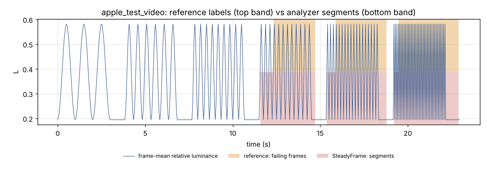

# External: openly licensed clips

Generated 2026-10-08 21:27 UTC by `python -m eval.external` at git `60e802c`, steadyframe 0.1.0, **OpenCV 5.0.0** (x86_64, CPython 3.11.17).

Clips from EA IRIS's test set (BSD-3-Clause), Apple's VideoFlashingReduction sample (MIT) and Intel's IoT DevKit sample videos (CC BY 4.0). Sources, pinned URLs and licences: `data/SOURCES.md`; labels and checksums: `data/external.yaml`. No label comes from this analyzer.

## Summary

| profile | clip verdicts agree | IRIS clips agree | IRIS fail frames inside a segment | per-second P / R / F1 | control seconds flagged |
|---|---|---|---|---|---|
| wcag | 18/18 | 8/8 | 35/35 | 1.000 / 1.000 / 1.000 | 0/551 |
| broadcast | 18/18 | 8/8 | 35/35 | 1.000 / 1.000 / 1.000 | 0/551 |

IRIS reports an *extended failure* (sustained flashing at four or more transitions a second for four of five seconds, from the broadcast guidance) on `iris_2Hz_6s`, with no flash failure. SteadyFrame does not implement that rule: those clips pass here and pass under IRIS's flash rule too. Counted as agreement on the flash rule, listed as a gap.

Apple clip: flashing is spatially uniform (worst quadrant deviation from the frame mean 0.0070), so the reference rules on the frame mean are a valid label. Mean IoU of the reference's failing intervals with the analyzer's failing spans (`detected_s`..`end_s`): 1.000.

Controls: 9.1 minutes of camera footage. Moving objects make single cells flash briefly (highest cell-level rate 5.0 Hz), but the cells over the rate never cover more than 8.6% of a 10-degree window (the rule is 25%).

## Per clip, profile `wcag`

| clip | set | label | got | agree | tp | fp | fn | label_fail_frames | label_fail_frames_covered | max_cell_rate_hz | max_window_area_over_rate | resolution | fps | realtime_factor |
|---|---|---|---|---|---|---|---|---|---|---|---|---|---|---|
| iris_2Hz_5s | iris | pass | pass | True | 0 | 0 | 0 | 0 | 0 | 2.5 | 0.000 | 640x360 | 5.00 | 101.0 |
| iris_2Hz_6s | iris | pass | pass | True | 0 | 0 | 0 | 0 | 0 | 2.5 | 0.000 | 640x360 | 25.00 | 22.0 |
| iris_3Hz_6s | iris | fail | fail | True | 1 | 0 | 0 | 6 | 6 | 3.5 | 1.000 | 640x360 | 25.00 | 25.9 |
| iris_GradualRedIncrease | iris | pass | pass | True | 0 | 0 | 0 | 0 | 0 | 1.0 | 0.000 | 640x360 | 25.00 | 24.4 |
| iris_extendedFLONG | iris | pass | pass | True | 0 | 0 | 0 | 0 | 0 | 1.5 | 0.000 | 640x360 | 25.00 | 27.6 |
| iris_flashStripes | iris | fail | fail | True | 2 | 0 | 0 | 29 | 29 | 12.5 | 0.667 | 640x360 | 25.00 | 25.5 |
| iris_gray | iris | pass | pass | True | 0 | 0 | 0 | 0 | 0 | 0.0 | 0.000 | 640x360 | 25.00 | 25.9 |
| iris_intermitentEF | iris | pass | pass | True | 0 | 0 | 0 | 0 | 0 | 1.5 | 0.000 | 640x360 | 25.00 | 26.2 |
| apple_test_video | apple | fail | fail | True | 11 | 0 | 0 | 210 | 210 | 12.0 | 1.000 | 480x270 | 24.00 | 37.0 |
| intel_bottle_detection | intel | pass | pass | True | 0 | 0 | 0 | 0 | 0 | 4.0 | 0.012 | 640x360 | 29.83 | 21.0 |
| intel_car_detection | intel | pass | pass | True | 0 | 0 | 0 | 0 | 0 | 4.5 | 0.086 | 768x432 | 12.50 | 52.4 |
| intel_classroom | intel | pass | pass | True | 0 | 0 | 0 | 0 | 0 | 3.0 | 0.000 | 1920x1080 | 30.00 | 3.6 |
| intel_face_demographics_walking | intel | pass | pass | True | 0 | 0 | 0 | 0 | 0 | 3.0 | 0.000 | 768x432 | 12.00 | 50.0 |
| intel_one_by_one_person_detection | intel | pass | pass | True | 0 | 0 | 0 | 0 | 0 | 3.0 | 0.000 | 768x432 | 10.00 | 59.6 |
| intel_people_detection | intel | pass | pass | True | 0 | 0 | 0 | 0 | 0 | 3.0 | 0.000 | 768x432 | 12.00 | 49.7 |
| intel_person_bicycle_car_detection | intel | pass | pass | True | 0 | 0 | 0 | 0 | 0 | 3.5 | 0.003 | 768x432 | 12.00 | 54.2 |
| intel_store_aisle_detection | intel | pass | pass | True | 0 | 0 | 0 | 0 | 0 | 4.0 | 0.021 | 720x404 | 59.94 | 7.9 |
| intel_worker_zone_detection | intel | pass | pass | True | 0 | 0 | 0 | 0 | 0 | 5.0 | 0.042 | 1920x1080 | 59.94 | 1.8 |

## Per clip, profile `broadcast`

| clip | set | label | got | agree | tp | fp | fn | label_fail_frames | label_fail_frames_covered | max_cell_rate_hz | max_window_area_over_rate | resolution | fps | realtime_factor |
|---|---|---|---|---|---|---|---|---|---|---|---|---|---|---|
| iris_2Hz_5s | iris | pass | pass | True | 0 | 0 | 0 | 0 | 0 | 2.5 | 0.000 | 640x360 | 5.00 | 121.3 |
| iris_2Hz_6s | iris | pass | pass | True | 0 | 0 | 0 | 0 | 0 | 2.5 | 0.000 | 640x360 | 25.00 | 24.3 |
| iris_3Hz_6s | iris | fail | fail | True | 1 | 0 | 0 | 6 | 6 | 3.5 | 1.000 | 640x360 | 25.00 | 25.8 |
| iris_GradualRedIncrease | iris | pass | pass | True | 0 | 0 | 0 | 0 | 0 | 1.0 | 0.000 | 640x360 | 25.00 | 27.2 |
| iris_extendedFLONG | iris | pass | pass | True | 0 | 0 | 0 | 0 | 0 | 1.5 | 0.000 | 640x360 | 25.00 | 27.8 |
| iris_flashStripes | iris | fail | fail | True | 2 | 0 | 0 | 29 | 29 | 12.5 | 0.561 | 640x360 | 25.00 | 25.8 |
| iris_gray | iris | pass | pass | True | 0 | 0 | 0 | 0 | 0 | 0.0 | 0.000 | 640x360 | 25.00 | 25.5 |
| iris_intermitentEF | iris | pass | pass | True | 0 | 0 | 0 | 0 | 0 | 1.5 | 0.000 | 640x360 | 25.00 | 29.2 |
| apple_test_video | apple | fail | fail | True | 11 | 0 | 0 | 210 | 210 | 12.0 | 1.000 | 480x270 | 24.00 | 38.0 |
| intel_bottle_detection | intel | pass | pass | True | 0 | 0 | 0 | 0 | 0 | 4.0 | 0.001 | 640x360 | 29.83 | 21.5 |
| intel_car_detection | intel | pass | pass | True | 0 | 0 | 0 | 0 | 0 | 4.5 | 0.010 | 768x432 | 12.50 | 50.2 |
| intel_classroom | intel | pass | pass | True | 0 | 0 | 0 | 0 | 0 | 3.0 | 0.000 | 1920x1080 | 30.00 | 3.4 |
| intel_face_demographics_walking | intel | pass | pass | True | 0 | 0 | 0 | 0 | 0 | 3.0 | 0.000 | 768x432 | 12.00 | 50.8 |
| intel_one_by_one_person_detection | intel | pass | pass | True | 0 | 0 | 0 | 0 | 0 | 3.0 | 0.000 | 768x432 | 10.00 | 60.7 |
| intel_people_detection | intel | pass | pass | True | 0 | 0 | 0 | 0 | 0 | 3.0 | 0.000 | 768x432 | 12.00 | 51.2 |
| intel_person_bicycle_car_detection | intel | pass | pass | True | 0 | 0 | 0 | 0 | 0 | 3.5 | 0.000 | 768x432 | 12.00 | 54.8 |
| intel_store_aisle_detection | intel | pass | pass | True | 0 | 0 | 0 | 0 | 0 | 4.0 | 0.002 | 720x404 | 59.94 | 7.9 |
| intel_worker_zone_detection | intel | pass | pass | True | 0 | 0 | 0 | 0 | 0 | 5.0 | 0.005 | 1920x1080 | 59.94 | 1.8 |

## Remediation on the clips with a failing label (`wcag`)

**fixed**: 3/3 pass whole-file re-verification, 1.00 attempts per segment, 2 approval request(s) (auto-granted offline).

| clip | status | after | segments | attempts | strategies | approvals | ssim_inside | runtime_s |
|---|---|---|---|---|---|---|---|---|
| iris_3Hz_6s | passed | pass | 1 | 1 | S1 | 1 | 0.344 | 5.8 |
| iris_flashStripes | passed | pass | 1 | 1 | S1 | 1 | 0.709 | 1.5 |
| apple_test_video | passed | pass | 3 | 3 | S1,S1,S1 | 0 | 0.980 | 8.2 |

**heuristic**: 3/3 pass whole-file re-verification, 1.33 attempts per segment, 2 approval request(s) (auto-granted offline).

| clip | status | after | segments | attempts | strategies | approvals | ssim_inside | runtime_s |
|---|---|---|---|---|---|---|---|---|
| iris_3Hz_6s | passed | pass | 1 | 1 | S4 | 1 | 0.332 | 5.8 |
| iris_flashStripes | passed | pass | 1 | 2 | S4 | 1 | 0.705 | 2.6 |
| apple_test_video | passed | pass | 3 | 3 | S4,S4,S4 | 0 | 0.986 | 8.5 |

