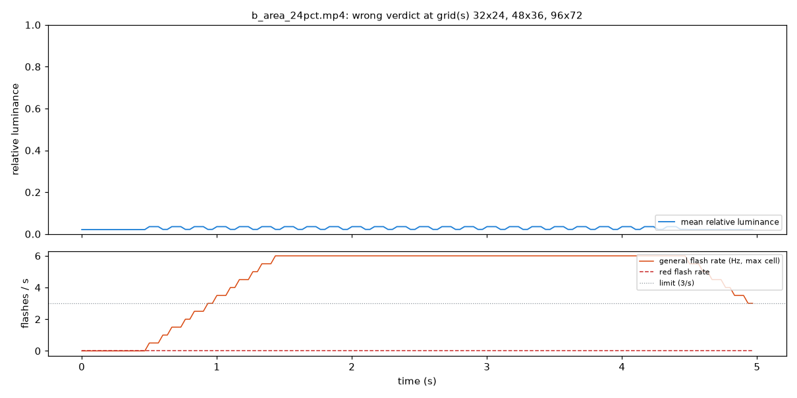
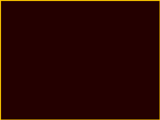
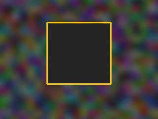

# Failure gallery

Generated 2026-09-20 01:27 UTC by `python -m eval.failure_gallery` at git `3c6cf81`, steadyframe 0.1.0, **OpenCV 5.0.0** (x86_64, CPython 3.11.15).

Stills are dimmed single frames with the detected regions outlined; nothing here animates.

## Grid sensitivity: b_area_24pct.mp4

Expected pass; wrong at grids 32x24, 48x36, 96x72. The flashing region is aligned to the 64x48 grid, so coarser or finer grids split its edge cells and the box-averaged luminance swing of a partial cell can land on either side of the 0.10 threshold. This is the quantisation limit of the cell-based area rule.

## Largest visible change: r_red_strobe_full.mp4

Fixed with S1,S3 in 2 attempt(s); SSIM inside the region 0.740, mean |dL| 0.093. Full-frame, full-swing strobes have no gentle fix: removing a 0.5 luminance swing is by definition a large change inside the region.

## Largest visible change: r_red_to_white.mp4

Fixed with S5,S3 in 5 attempt(s); SSIM inside the region 0.786, mean |dL| 0.396. Full-frame, full-swing strobes have no gentle fix: removing a 0.5 luminance swing is by definition a large change inside the region.

## Largest visible change: m_strobe_on_moving_bg.mp4

Fixed with S1 in 1 attempt(s); SSIM inside the region 0.806, mean |dL| 0.132. Full-frame, full-swing strobes have no gentle fix: removing a 0.5 luminance swing is by definition a large change inside the region.

## Pattern detector is experimental

`p_stripes_static` is flagged as pattern risk, but the DFT peak test has no notion of viewing distance and would also flag fine textures with enough contrast; it is reported as a warning, never a fail, and is off by default in the service.

## Fine balanced patterns are not exempted

WCAG exempts white-noise-like flashing with squares under 0.1 degree. We do not implement the exemption, so such content is over-flagged (conservative).

## No display model

Relative luminance from sRGB code values stands in for screen luminance in cd/m2; a very dim or very bright display changes the real stimulus and we cannot know it.

